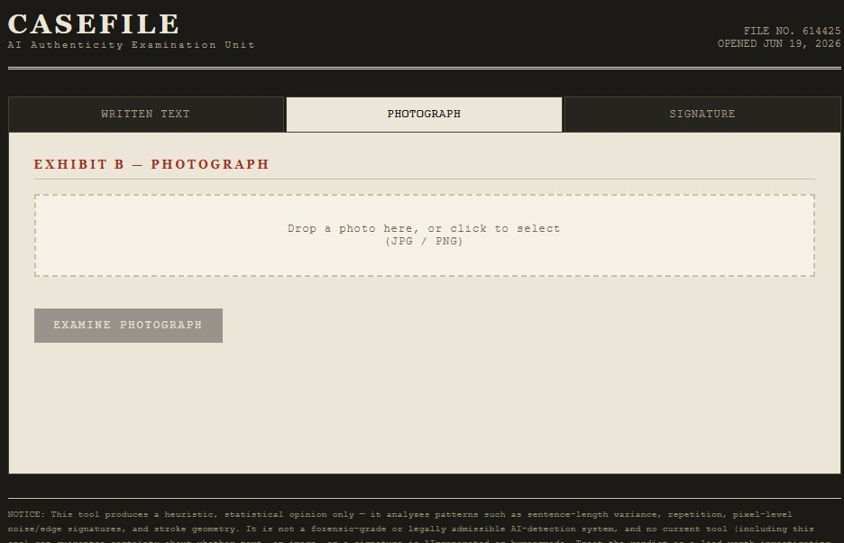
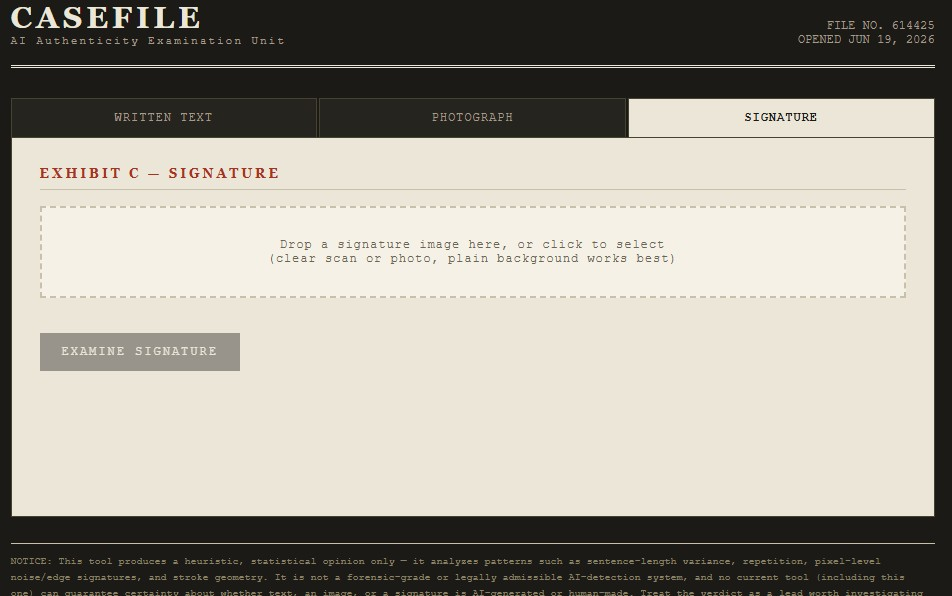
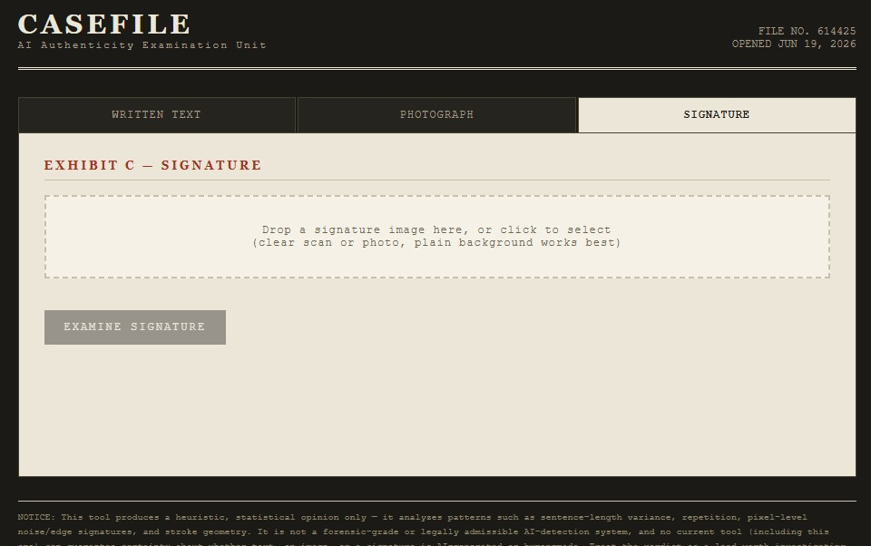

# Casefile — AI Authenticity Lab

A single-file HTML tool that gives a heuristic "AI or human?" opinion on three kinds of evidence: written text, photographs, and signatures. Runs entirely in the browser — no server, no install, no data leaves your machine.

##Images

| Photograph tab | Signature tab |
|---|---|
|  |
 |

## Features

### Exhibit A — Written Text
Paste a passage (15+ words) and get a score based on:
- **Burstiness** — sentence-length variation (AI text tends toward uniform length; human writing is jagged)
- **Lexical diversity** — ratio of unique to total words (low = repetitive = more AI-like)
- **Stock AI phrases** — detects filler like "furthermore," "delve into," "plays a crucial role"
- **Punctuation fingerprint** — em-dashes, semicolons, exclamation marks

### Exhibit B — Photograph
Drop in a JPG/PNG and get a score based on pixel-level analysis:
- **Sensor noise** — real cameras have grain; generated/upscaled images are often unnaturally clean
- **Edge energy** — sharpness patterns
- **Tonal banding** — gaps in the color histogram from synthetic gradients/compression
- **Saturation** — AI images often run oversaturated

### Exhibit C — Signature
Drop in a signature image and get a score based on ink geometry:
- **Stroke-width consistency** — human pens vary pressure; printed/traced/AI strokes are too uniform
- **Edge roughness** — natural pen jitter vs. suspiciously smooth vector-like contours
- **Ink fill ratio** within the signature's bounding box

## Output

Each exhibit returns:
- A stamped verdict: **LIKELY HUMAN** / **INCONCLUSIVE** / **LIKELY AI**
- A 0–100 AI-likelihood score with a visual bar
- A bullet list of the specific numbers behind the call

## Tech

- Pure HTML/CSS/JavaScript — one file, no build step, no dependencies
- Image/signature analysis uses the Canvas API for pixel-level math (grayscale conversion, Laplacian edge detection, local noise residuals, histogram analysis)
- Text analysis uses regex and basic statistics (no external NLP libraries)
- Nothing is uploaded anywhere — all processing happens client-side in the browser

## How to use

1. Open `ai-detector.html` in any modern browser
2. Pick a tab: Written Text, Photograph, or Signature
3. Paste text or drop a file
4. Click "Examine" and read the verdict + findings

## Limitations (read this)

This is a **heuristic, statistical tool**, not a trained machine-learning classifier. It looks for patterns and proxies that *correlate* with AI generation, not a confirmed signature of it. No current tool — including commercial, well-funded ones — can guarantee certainty about whether text, an image, or a signature is AI-generated or human-made.

Treat every verdict as a **lead worth investigating further**, not a conclusion. Don't use this as the sole basis for accusations, academic penalties, legal claims, or authentication decisions.

## File

- `ai-detector.html` — the entire app (open directly in a browser)
